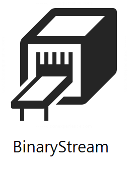
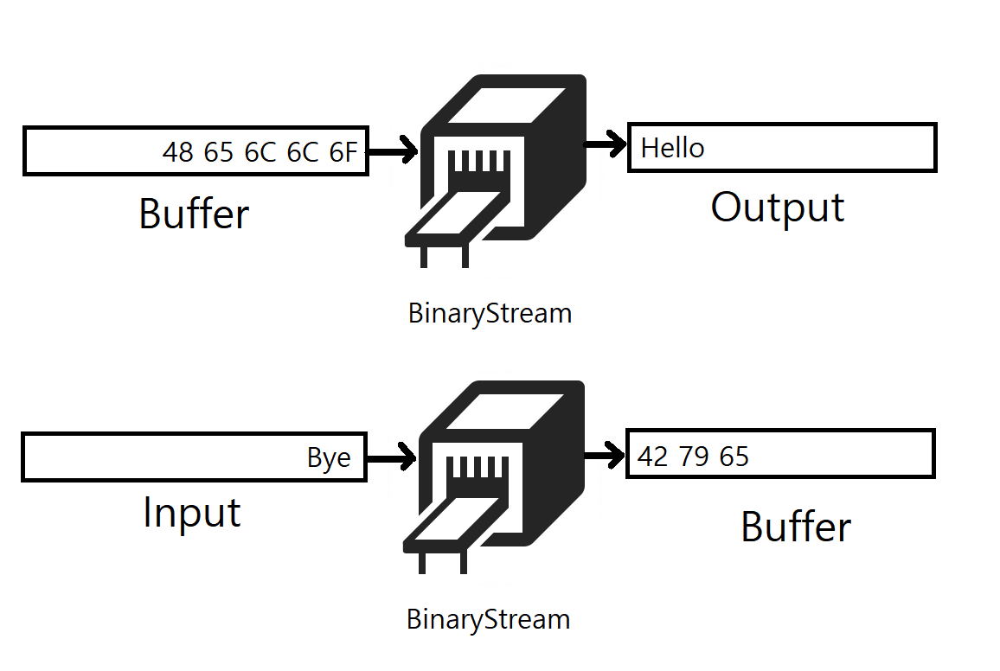
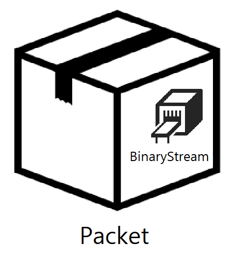
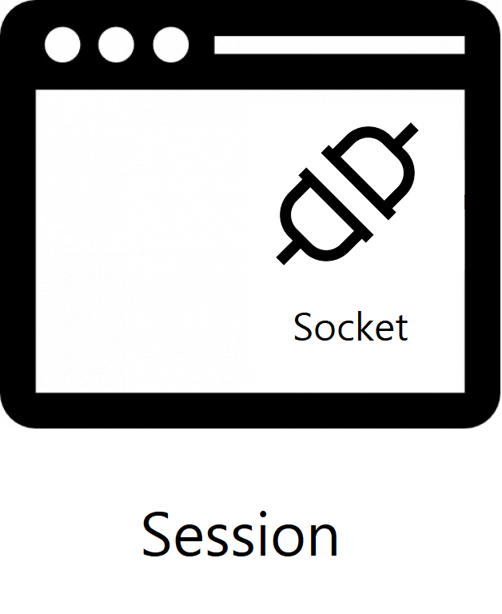
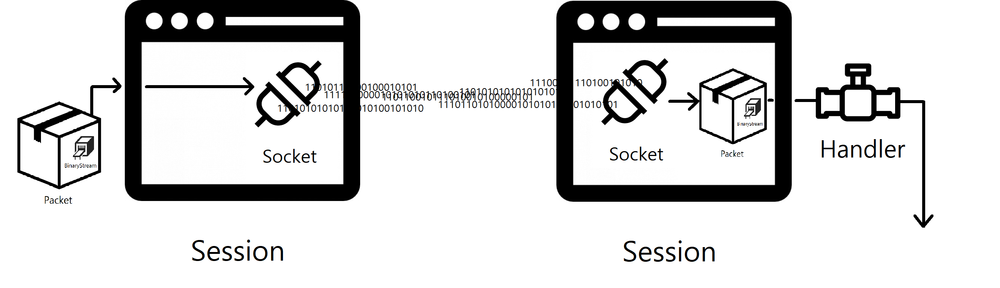
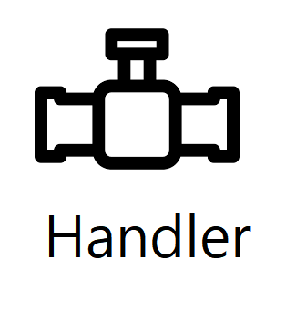
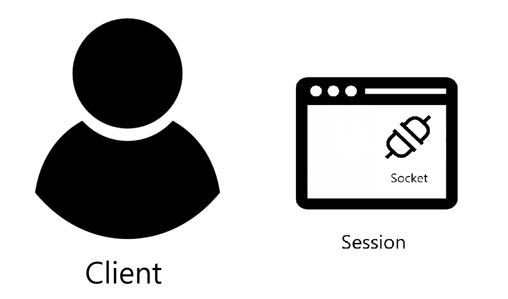
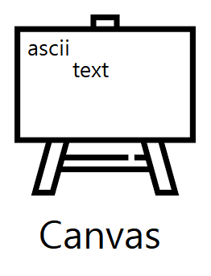
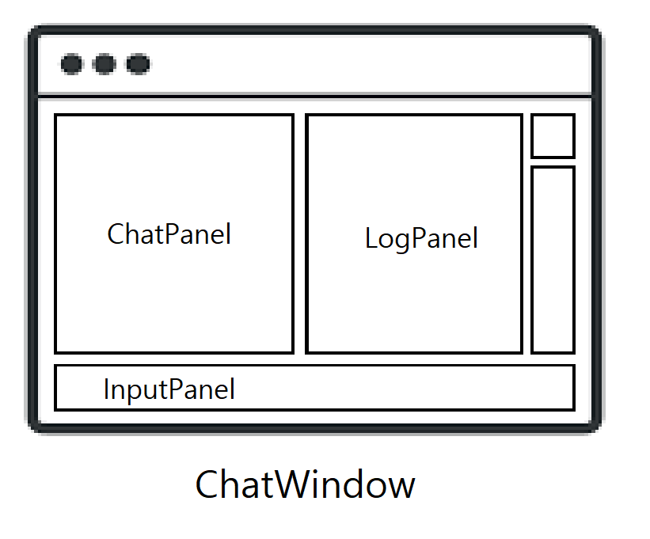

# Cpphat API 문서

<br>

<br>

# 클래스 목록

*   **Configure.hpp**
    -   class Configure
*   **Logger.hpp**
    -   class LogChannel
    -   static class Logger
*   **Socket.hpp**
    -   class InternetAddress
    -   class Socket
    -   class SocketError
*   **BinaryStream.hpp**
    -   class BinaryStream
*   **Session.hpp**
    -   abstract class Packet extends BinaryStream
    -   class UnknownPacket extends Packet
    -   class ChatPacket extends Packet
    -   class AddUserPacket extends Packet
    -   class RemoveUserPacket extends Packet
    -   class Session
    -   abstract class SessionHandler
*   **Server.hpp**
    -   class Server
    -   class ServerSessionHandler extends SessionHandler
*   **Client.hpp**
    -   class Client
    -   class ClientSessionHandler extends SessionHandler
*   **Math.hpp**
    -   class Point
*   **Panel.hpp**
    -   class Canvas
    -   class InvisibleCanvas extends Canvas
    -   abstract class Panel
    -   class TextPanel extends Panel
    -   class InputPanel extends TextPanel
    -   class ScrollPanel extends TextPanel
    -   class LogPanel extends ScrollPanel, std::ostream, std::streambuf
    -   class ChatPanel extends ScrollPanel, std::ostream, std::streambuf
*   **ChatWindow.hpp**
    -   class ChatWindow

<br>

# Configure
### class Configure

key-value 기반의 프로그램 관련 설정을 가지고 있는 클래스입니다. 생성자 `Configure(const char * _file)` 에서 받은 파일명으로부터 설정값을 읽어옵니다. `GetString()`, `GetBool()`, `GetInt()` 메서드에 매개변수로 key를 넣어 다양한 데이터 형의 value을 받아올 수 있습니다.

<br>

### 멤버 목록

*   **bool ContainsKey(std::string key)**
key 가 존재하는지 여부를 `bool` 로 반환합니다.
<br>

*   **std::string GetString(std::string key, std::string defaultValue)**
key 를 통해 `std::string` value을 가져옵니다. 만약 key가 존재하지 않을 시, 매개변수로 받은 `defaultValue` 를 반환합니다.
<br>

*   **bool GetBool(std::string key, bool defaultValue)**
key 를 통해 `bool` value을 가져옵니다. 만약 key가 존재하지 않을 시, 매개변수로 받은 `defaultValue` 를 반환합니다.
<br>

*   **int GetInt(std::string key, int defaultValue)**
key 를 통해 `int` value을 가져옵니다. 만약 key가 존재하지 않을 시, 매개변수로 받은 `defaultValue` 를 반환합니다.
<br>

*   **const std::map<std::string, std::string>& GetAll() const**
모든 설정 값을 `std::map` 으로 반환합니다.
<br>

*   **static const Configure Ini**
프로그램의 초기 설정값이 저장되어 있는 `Cpphat.ini` 입니다.
`Cpphat.ini` 에서 사용가능한 옵션은 다음과 같습니다.
    - **server-ip** : `Server` 에서 `Bind()` 할 시 사용할 ip
    - **server-port** : `Server` 에서 `Bind()` 할 시 사용할 port, 범위는 `unsigned short` (0~65535)
    - **client-ip** : `Client` 에서 `Connect()` 할 시 사용할 ip
    - **client-port** : `Client` 에서 `Connect()` 할 시 사용할 port, 범위는 `unsigned short` (0~65535)
    - **debug** : 통신 관련 디버깅을 할 건지 여부. `true` 와 `false` 중 입력

<br>

# LogChannel
### class LogChannel

`Logger` 클래스에서 사용될, 하나의 `LogLevel` 을 가진 채널입니다. `operator()` 을 호출하여 `LogLevel` 을 출력할 수 있습니다.
`operator<<` 를 호출하여 `std::cout` 을 사용하듯이 원하는 내용을 출력할 수 있습니다.

<br>

# Logger
### static class Logger
프로그램 실행중에, 디버깅이나 특정 이벤트시 기록을 위한 클래스입니다.
객체를 가지지 않으며 정적 멤버로만 상호작용합니다.
이 클래스를 통해 출력된 내용은 `Cpphat.log` 파일에 저장됩니다.

`Info`, `Warn`, `Error`, `Debug` 채널을 가지고 있습니다.
원하는 채널을 골라 `operator()` 를 호출한 뒤, 원하는 내용을 `operator<<` 를 호출하여 출력하면 됩니다.
예시로, 아래와 같이 경고를 기록할 수 있습니다.
```cpp
Logger::Warn() << "Warning on line " << 13 << Logger::EOL;
```

<br>

### 멤버 목록

*   **static const char EOL**
새로운 줄로 변경합니다.
<br>

*   **static void SetOutputStream(std::ostream& _os)**
이 클래스를 통해 출력되는 내용이 향할 출력 스트림을 변경할 수 있습니다. `std::cout` 가 될 수도 있고, `std::ostream` 을 상속받는 다른 클래스가 될 수도 있습니다.

<br>

# InternetAddress
### class InternetAddress
`IP` 와 `Port` 를 묶은 클래스입니다.
`Socket` 의 `Connect()`, `Bind()` 에서 이 객체를 사용합니다.

<br>

### 멤버 목록

*   **std::string GetIp()**
IP를 반환합니다.
<br>

*   **unsigned short GetPort()**
Port를 반환합니다. 범위는 0 ~ 65535 입니다.

<br>

# Socket
### class Socket


`WinSock2.h` 를 래핑한 클래스로, `Client` 관련 메서드 `Connect()` 와 `Server` 관련 메서드 `Bind()`, `Listen()`, `Accept()`, I/O 관련 메서드 `Send()`, `Receive()` 를 가지고 있습니다.

`WinSock2.h` 특성 상, `Socket` 사용전에 전역 메서드인 `SocketStartup()` 를 반드시 호출해주어야 합니다.
종료시 마찬가지로 `SocketCleanup()` 을 호출하여야 합니다.

`Send()` 와 `Receive()` 메서드 외에 다른 `Socket` 통신 관련 메서드에서 실행 중 에러가 발생할 시, 1을 리턴합니다. 성공시 0을 리턴합니다.
에러 코드를 얻을 땐 1을 리턴받은 후 `GetLastError()` 메서드를 호출하면 됩니다.

```cpp
if(m_socket.Connect()){
  Logger::Error() << SocketError(m_socket.GetLastError()) << Logger::EOL;
  return;
}
```

<br>

### 멤버 목록

*   **void SetInternetAddress(const InternetAddress _internetAddress)**
Socket 객체가 `Connect()` 하거나 `Bind()` 할 IP와 Port를 설정합니다.
<br>

*   **int Init()**
객체 자신을 Initialize 합니다.
이 메서드 내에서 설정되는 옵션은 다음과 같습니다.
    - AF_INET : Internet Protocol 버젼 4 (IPv4)
    - SOCK_STREAM : 신뢰할 수 있고, 양방향 통신이 가능하며 연결 지향적인 TCP
    - IPPROTO_TCP : TCP
<br>

*   **int SetNonBlockingMode(bool val)**
`Socket` 객체 자신을 Non-blocking 모드로 설정합니다.
`Socket` 관련 작업 수행에 delay가 없어집니다.
Blocking 모드와 대조적으로 작업 수행에 실패할 시 성공할 때 까지 대기하는 것이 아닌, `WSAEWOULDBLOCK` 를 리턴합니다.
<br>

*   **int Connect()**
`Client` 전용 메서드입니다.
`SetInternetAddress()` 메서드로 지정된 IP와 Port로 연결을 시도합니다.
<br>

*   **int Bind()**
`Server` 전용 메서드입니다.
`SetInternetAddress()` 메서드로 지정된 IP와 Port로 바인딩합니다.
<br>

*   **int Listen()**
`Server` 전용 메서드입니다.
`Client` 의 연결을 허용하는 메서드입니다.
<br>

*   **int Accept(Socket& client)**
`Client` 의 연결 허용을 시도합니다. 연결 허용 성공 시, 참조로 받은 매개변수가 새로 연결된 `Client` 와 통신을 담당할 `Socket` 이 됩니다.
<br>

*   **int Receive(unsigned char * buffer, int size)**
데이터를 연결된 `Socket` 으로부터 받습니다.
반환된 값이 음수일 시, 에러가 발생했다는 뜻입니다.
반환된 값이 0일 시, 연결이 종료되었다는 뜻입니다.
반환된 값이 양수일 시, 받은 데이터의 길이를 뜻합니다.
<br>

*   **int Send(unsigned char * buffer, int size)**
데이터를 연결된 Socket에 전송합니다.
반환된 값이 음수일 시, 에러가 발생했다는 뜻입니다.
반환된 값이 양수일 시, 전송된 byte길이를 뜻합니다.
<br>

*   **int Shutdown()**
`Socket` 의 연결을 종료합니다.
`Close()` 와 달리, `Shutdown()` 은 상대측에 종료를 통보합니다.
<br>

*   **int Close()**
`Socket` 을 닫습니다.

<br>

# SocketError
### class SocketError
`Socket` 의 에러 코드를 메세지로 출력하기 위한 클래스입니다.
에러 코드를 생성자로 받으며, 출력 스트림의 `operator<<` 메서드에 사용할 시 에러 코드에 맞는 에러 메세지를 출력합니다.

```cpp
if(m_socket.Bind()){
  Logger::Error() << SocketError(m_socket.GetLastError()) << Logger::EOL;
  return;
}
```

<br>

# BinaryStream
### class BinaryStream



여러가지 데이터 형을 `unsigned char` 배열로 바꾸고 `Buffer` 에 쌓아주는 역할을 하는 클래스입니다.

`unsigned char` 배열로 바꿀 수 있는 데이터 형 목록
*   `short`
*   `unsigned short`
*   `int`
*   `unsigned int`
*   `std::string`



데이터는 순차적으로 쌓입니다. `Stack` 과 비슷합니다.

```cpp
BinaryStream bs;

bs << 10;
bs << "Hello";

std::cout << bs.Dump() << std::endl; // 0A 00 00 00 05 00 00 00 ....

int val1;
std::string val2;

bs >> val1; // 10
bs >> val2; // "Hello"
```

<br>

# Packet
### abstract class Packet extends BinaryStream



`Socket` 간 주고받는 `char` 배열을 논리적인 단위로 분할한 `Packet` 입니다.
기본적으로 모든 `Packet` 은 아래와 같은 `Header` 를 가집니다.

*   **unsigned int (4 byte)** : `Packet` 의 전체 byte 길이
*   **unsigned short (2 byte)** : `Packet` 의 Type

이 클래스를 상속받는 클래스에서는, `Packet` 을 구분할 수 있는 `unsigned short GetPacketType()`, `Buffer` 를 동적할당 받기 위해 길이를 확인하는 `unsigned int GetDataLength()`, 필드를 `Buffer` 에 `unsigned char` 배열로 채우기 위한 `void EncodeData()`, `Buffer` 으로부터 필드를 복원하기 위한 `void DecodeData()` 를 정의하여야 합니다.

<br>

### 멤버 목록

*   **virtual unsigned short GetPacketType()**
`Packet` 을 상속받는 클래스들을 구분하기 위한 메서드로, 이 클래스를 상속받는 클래스에서는 자신을 구분할 수 있는 고유의 정수값(예: 1, 2, 3 ...) 을 반환하여야 합니다.
<br>

*   **virtual unsigned int GetDataLength()**
상속받는 클래스에서, 자신의 필드들이 Encode 되었을 때의 `unsigned char` 배열의 크기를 반환하여야 합니다.
<br>

*   **void EncodeHeader()**
패킷의 헤더를 `unsigned char` 배열로 Encode 합니다.
<br>

*   **void AllocatePayload()**
데이터 길이를 확인한 후, `Buffer` 를 `unsigned char` 배열로 동적할당하는 메서드입니다.
<br>

*   **void Encode()**
먼저 `Buffer` 를 동적할당받고, `EncodeHeader()` 와 `EncodeData()` 를 호출하여 패킷을 `unsigned char` 배열로 완전하게 Encode 합니다.
<br>

*   **virtual void DecodeData()**
상속받는 클래스에서, `unsigned char` 배열로 부터 어떻게 필드를 복원할 지 정의되어야 합니다.
<br>

*   **void Decode()**
unsigned char 배열로 부터 필드를 Decode 합니다.
`Header` 는 `Session` 클래스에서 Decode 하기 때문에, 이 메서드에서 `Header` 의 Decode 는 생략됩니다. 오직 필드만 Decode 합니다.
<br>

*   **virtual bool Handle(SessionHandler& handler)**
Decode 된 `Packet` 이 `SessionHandler` 객체로 어떻게 넘길 것인지 정의되어야 합니다.
<br>

# UnknownPacket
### class UnknownPacket extends Packet

`Packet Type` 을 알 수 없는 패킷입니다.
`Session` 에서 `Packet` 을 Decode할 때, `Packet Type` 가 정의되어 있지 않으면 이 클래스의 객체를 반환합니다.

<br>

# ChatPacket
### class ChatPacket extends Packet
채팅 메세지 `Packet` 입니다. 채팅을 보낸 유저의 ID와 메세지 내용이 담겨있습니다.
`Client` -> `Server` 방향으로 전송되며 `Server` 에서 이 `Packet` 을 받으면 모든 유저에게 Broadcast 합니다.
Broadcast 함으로써 모든 유저는 메세지가 전송되었다는 사실과 메세지의 내용을 알 수 있습니다.

<br>

### 멤버 목록

*   **int UserId**
채팅을 보낸 유저의 ID입니다.
<br>

*   **std::string Message**
메세지의 내용입니다.

<br>

# AddUserPacket
### class AddUserPacket extends Packet

유저의 접속을 알리는 패킷입니다.
`Server` -> `Client` 방향으로만 전송됩니다.

<br>

### 멤버 목록

*   **int UserId**
접속한 유저의 ID입니다.

<br>

# RemoveUserPacket
### class RemoveUserPacket extends Packet

유저가 접속을 끊은 것을 알리는 패킷입니다.
`Server` -> `Client` 방향으로만 전송됩니다.

<br>

### 멤버 목록

*   **int UserId**
접속을 끊은 유저의 ID입니다.

<br>

# Session
### class Session



`Socket` 을 가지며, `Packet` 의 처리를 맡는, `Socket` 보다 좀 더 추상적인 클래스입니다.
또한 전송 관련 에러 처리를 담당하기도 합니다.

`Session` 간 구분을 위해 고유의 ID를 가집니다.
`Client` 의 `Session` 은 무조건 -1 입니다.
`Server` 의 경우 0부터 시작하여 1, 2, 3... 순서로 ID가 할당됩니다.

<br>



세션은 위의 그림과 같이 커뮤니케이션합니다.

<br>

### 멤버 목록

*   **void SendPacket(Packet& packet)**
`Packet` 의 `Encode()` 메서드를 호출하여 `unsigned char` 배열로 Encode 후, 상대방의 `Socket` 에 전송합니다.
<br>

*   **void ReceivePacket()**
상대방의 `Socket` 에서 데이터를 받았는지 확인하고, 받았으면 `Packet` 객체로 만들어 `SessionHandler` 에게 넘깁니다.
<br>

*   **void Close()**
`Session` 을 종료합니다.

<br>

# SessionHandler
### abstract class SessionHandler



`Session` 에서 `Packet` 을 받으면 `Session` 에서 처리하지 않고, `SessionHandler` 로 처리를 넘깁니다.
이렇게 함으로써 `Server` 와 `Client` 가 같은 `Packet` 클래스에 대해 다른 처리를 할 수 있습니다.

<br>

# Server
### class Server


새로운 `Client` 의 연결을 기다리는 `Socket` 을 가지고 있습니다.
새로운 `Client` 의 연결을 받으면, `Session` 을 생성하여 `std::map` 객체에 보관합니다.

이 클래스는 싱글톤 패턴을 지원합니다.
```cpp
Server::Instance.Init();
while(true){
  Server::Instance.Tick();
}
```

<br>

### 멤버 목록

*   **static Server Instance**
특별한 경우가 아닌 이상 `Server` 객체는 하나만 존재하여야 합니다.
하나의 인스턴스를 쉽게 관리하기 위해 이 정적 멤버를 만들었습니다.
<br>

*   **int Init()**
객체 자신을 initialize합니다.
<br>

*   **void Tick()**
`Session` 의 Accept, `Session` 의 패킷 처리 등 `Server` 에서 해야 될 처리를 Tick 합니다.
<br>

*   **void Close()**
이 객체를 사용 중단합니다.

<br>

# ServerSessionHandler
### class ServerSessionHandler

`Server` 에서 받은 `Packet` 을 어떻게 처리할건지 정의되어 있습니다.
예로, `ChatPacket` 을 받으면 접속한 모든 `Client` 에 Broadcast 합니다.

<br>

# Client
### class Client



`Server` 로 연결하는 `Class` 입니다.
`Session` 객체를 가지고 있습니다.

이 클래스는 싱글톤 패턴을 지원합니다.
```cpp
Client::Instance.Init();
while(true){
  Client::Instance.Tick();
}
```

<br>

### 멤버 목록

*   **static Client Instance**
특별한 경우가 아닌 이상 하나의 프로그램 내에서 `Client` 객체는 하나만 존재하여야 합니다.
하나의 인스턴스를 쉽게 관리하기 위해 이 정적 멤버를 만들었습니다.
<br>

*   **int Init()**
객체 자신을 initialize합니다.
<br>

*   **void Tick()**
`Packet` 의 `Send()` 와 `Receive()` 등 `Client` 의 처리를 Ticking 합니다.
<br>

*   **void Close()**
이 객체를 사용 중단합니다.
<br>

*   **void SendPacket(Packet& packet)**
연결된 `Server` 로 `Packet` 을 전송합니다.
<br>

*   **void SendMessage(std::string message)**
연결된 `Server` 로, `Client` 로써 메세지를 전송합니다.

<br>

# ClientSessionHandler
### class ClientSessionHandler extends SessionHandler

`Client` 에서 받은 `Packet` 을 어떻게 처리할건지 정의되어 있습니다.
예로, `AddUserPacket` 을 받으면 `Client` 의 출력 스트림에 접속 알림 문자열을 넣습니다.

<br>

# Point
### class Point

콘솔 화면에서 좌표계를 사용하기 위해 생성한 `struct` 에 가까운 클래스입니다.
단순하게 `int X, Y` 멤버를 가지고 있으며 접근 지정자는 `public` 입니다.
`+`, `-`, `+=`, `-=` 등 다양한 `operator` 를 지원합니다.

<br>

# Canvas
### class Canvas



`Panel` 을 콘솔에 그려주는 클래스입니다.

<br>

# Panel
### abstract class Panel


콘솔 화면에서 구역의 단위입니다.
입력을 받는 `Panel`, 채팅이 표시되는 `Panel` 등 다양하게 활용이 가능합니다.

<br>

# TextPanel
### class TextPanel extends Panel
텍스트를 쓸 수 있는 `Panel` 입니다.

<br>

# InputPanel
### class InputPanel extends TextPanel

키보드에서 텍스트 입력을 받을 수 있는 클래스입니다.

<br>

# ScrollPanel
### class ScrollPanel extends TextPanel

문자열 한 줄이 하나의 `Item` 이 되며, `Item` 이 리스트 형식으로 표시되며 스크롤이 가능합니다.

<br>

# LogPanel
### class LogPanel extends ScrollPanel, std::ostream, std::streambuf

로그가 표시되는 `Panel` 입니다.

<br>

# ChatPanel
### class ChatPanel extends ScrollPanel, std::ostream, std::streambuf

채팅 메세지가 표시되는 `Panel` 입니다.

<br>

# ChatWindow
### class ChatWindow



`Panel` 들을 관리하는 클래스입니다.
`Tab` 키를 눌러 `Focus` 를 바꿀 수 있습니다.
키보드 입력을 `Focus` 중인 `Panel` 에 전달합니다.
